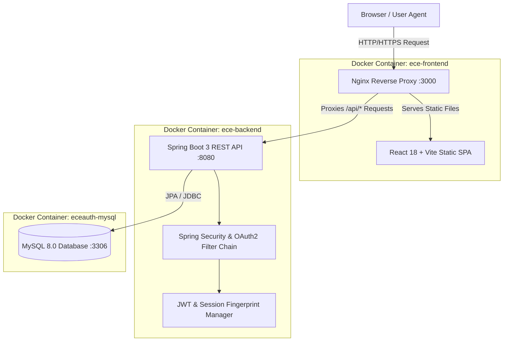
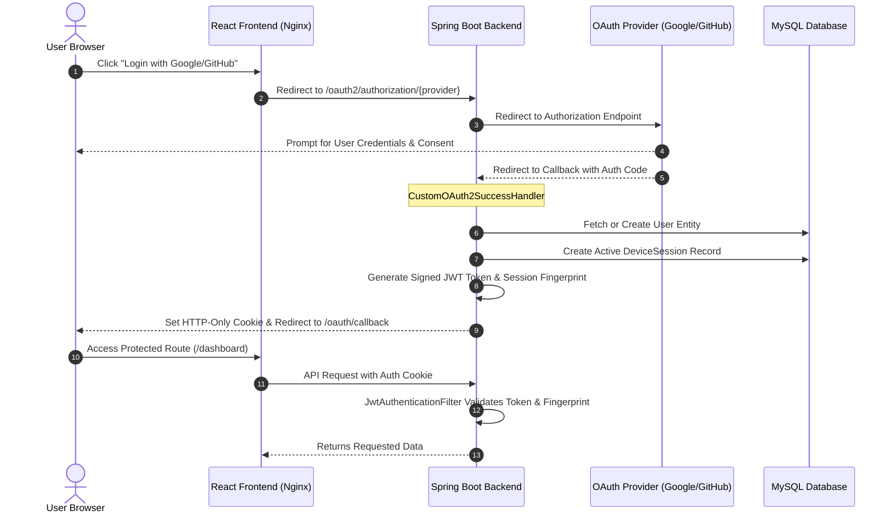

# 🏛️ System Architecture & Security Design

This document outlines the technical architecture, security protocols, and system flows of the **ECE Authentication System - Premium**.

---

## 1. High-Level System Architecture

The application is structured into three main layers: a React Single-Page Application (served via Nginx), a Spring Boot REST API, and a MySQL relational database.

## 2. OAuth2 & JWT Session Authentication Flow

This diagram illustrates how users authenticate via Google or GitHub, receive an HTTP-Only cookie, and establish a session tracked in the database.

